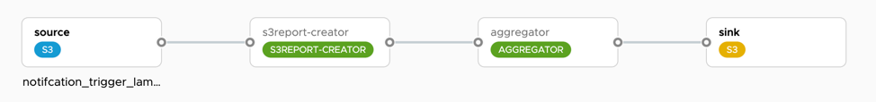

```
notifcation-trigger-lambda=source: s3 --file.consumer.mode=ref --s3.common.endpoint-url="http://minio.tanzu-helm-resources:9000" --s3.common.path-style-access=true --s3.supplier.remote-dir=scdf --cloud.aws.credentials.accessKey=minio --cloud.aws.credentials.secretKey=minio123 --cloud.aws.region.static=us-east-1 --cloud.aws.stack.auto=false | s3report-creator | aggregator --aggregator.aggregation="#this.![new String(payload)]" --aggregator.group-timeout=1000 | sink: s3 --s3.common.endpoint-url="http://minio.tanzu-helm-resources:9000" --s3.common.path-style-access=true --s3.consumer.bucket=sink --s3.consumer.key-expression=headers.report_name --cloud.aws.credentials.accessKey=minio --cloud.aws.credentials.secretKey=minio123 --cloud.aws.region.static=us-east-1 --cloud.aws.stack.auto=false
```

## need to fix
Currently running on spring 2.7 and should go to 3 or update to enterprise subscription.